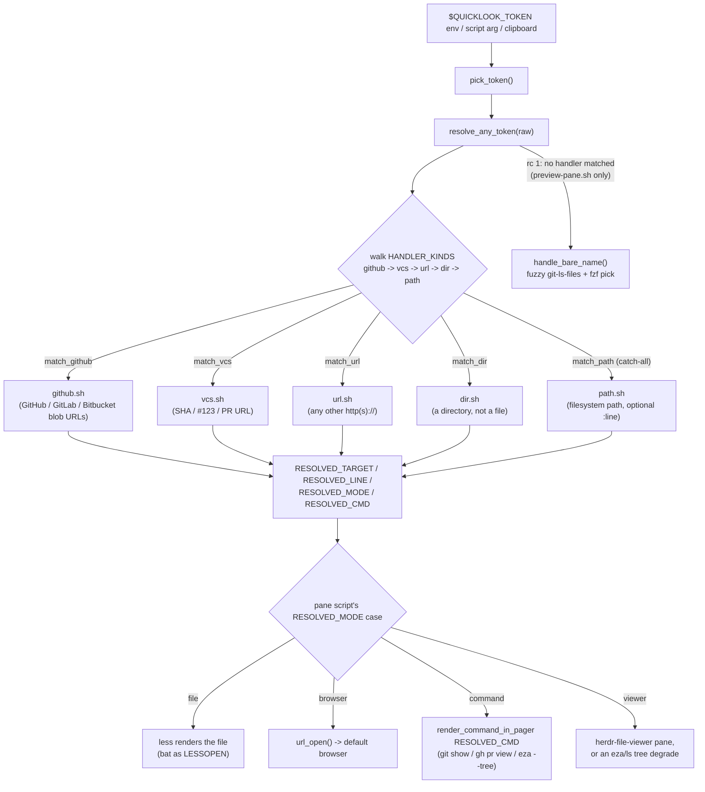
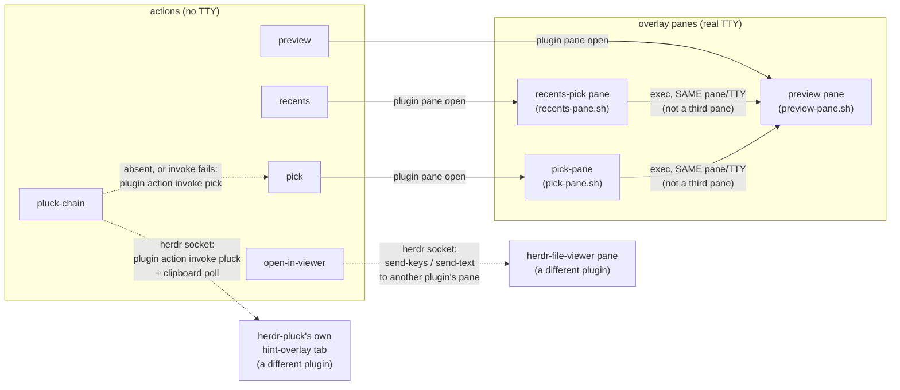
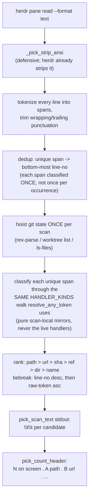

# DESIGN.md

Architecture of herdr-quicklook: how a clipboard token turns into a rendered
file, a browser tab, or a paged command. User-facing behavior lives in
[README.md](README.md); this is the "how", for anyone extending it.

## Token flow

Every action that OPENS a token (`preview`, `open-in-viewer`, `recents`,
and `pick` once a candidate is chosen) ends up calling the same two
functions in `scripts/lib.sh`: `pick_token` to get a raw string,
`resolve_any_token` to classify and resolve it. `pick` additionally has its
own scan-time path for finding candidates in the first place - see
[Pick anywhere](#pick-anywhere) below.



`resolve_any_token` returns 1 only when a `path`-shaped token's `resolve()`
can't find a file anywhere (github/url/vcs/dir always resolve one way or
another: worst case `github.sh`/`url.sh` fall back to `browser` mode). Only
`preview-pane.sh` has a TTY to run an interactive fzf pick in, so the
bare-name fallback is opt-in and called directly there, never wired into
`HANDLER_KINDS`: wiring it into the registry would have changed
`open-in-viewer.sh`'s behavior too, which never had the fuzzy fallback
before this architecture existed.

## Handler registry

A token *kind* lives entirely in one file, `scripts/handlers/<kind>.sh`,
and exports exactly two functions:

```sh
match_<kind> <raw>    # rc 0 if this handler owns the token's shape.
                      # No resolution work, no side effects.
handle_<kind> <raw>   # resolves the token. On success sets RESOLVED_TARGET /
                      # RESOLVED_LINE / RESOLVED_MODE (+ RESOLVED_CMD for
                      # command mode) and returns 0. Returns 1 if it owns the
                      # shape but couldn't resolve a target.
```

`scripts/lib.sh` auto-sources every `scripts/handlers/*.sh` at source time
(a glob loop), so a new kind never touches the sourcing mechanism, only
`HANDLER_KINDS` and the new file:

```sh
HANDLER_KINDS=(github vcs url dir path)
```

**Order matters.** `resolve_any_token` walks the array and dispatches to the
first `match_<kind>` that accepts the token. Two rules keep that safe:

- `path` is the catch-all (`match_path` always returns 0) and **must stay
  last**, or every later-registered kind becomes dead code.
- A more specific, host-aware kind checks before a generic one. `vcs` sits
  before `url` because a GitHub PR URL (`https://github.com/o/r/pull/42`)
  structurally also matches `url.sh`'s generic `http(s)://` predicate; if
  `url` were checked first it would claim every PR URL for the browser
  before `vcs` ever got a look.

### RESOLVED_MODE: the four render shapes

| Mode | Meaning | Set by | Pane-script behavior |
|---|---|---|---|
| `file` | `RESOLVED_TARGET` is a local path (`RESOLVED_LINE` optional) | `github.sh`, `path.sh` | rendered/driven directly |
| `browser` | `RESOLVED_TARGET` is a URL | `github.sh` (no local checkout), `url.sh` | `url_open "$RESOLVED_TARGET"` |
| `command` | `RESOLVED_CMD` (a bash **array**, not a string) is the argv to run; its output is paged | `vcs.sh`, `dir.sh` (no viewer installed) | `preview-pane.sh` pages it directly (`render_command_in_pager`); `open-in-viewer.sh` has no pager, so it re-invokes the same raw token through `open-preview.sh` |
| `viewer` | `RESOLVED_TARGET` is a directory to root the file-viewer at | `dir.sh` (viewer installed) | `open-in-viewer.sh` reuses the file case's goto-path send-keys sequence; `preview-pane.sh` can't drive another pane's socket, so it permanently degrades to paging an `eza --tree`/`ls -la` listing |

`RESOLVED_CMD` is a real array, never a flattened string, because a
command-mode handler runs an external tool (`git show`, `gh pr view`)
against **untrusted clipboard input**. Rebuilding an argv from a joined
string would reopen exactly the shell-injection surface the mode exists to
avoid, see `vcs.sh`'s anchored regexes and its own comment on `git show
--end-of-options` vs `git show --`.

### Adding a new kind

A purely additive kind (mode `file` or `browser` only) needs zero edits to
either pane script:

1. `scripts/handlers/<kind>.sh` with `match_<kind>` / `handle_<kind>`.
2. One line: insert `<kind>` into `HANDLER_KINDS` in `scripts/lib.sh`, before `path`.

A kind that wants to emit `command` or `viewer` for the first time (or that
needs a token-kind-specific interactive fallback, like `bare-name.sh`) is
the one exception where the pane scripts' own `RESOLVED_MODE` case blocks
may need a look, those bodies are the single place all four modes render.

## The lesskey three-slot map

The preview overlay is `less`, driven by a `lesskey`-compiled binding file.
`less` exposes exactly **three** independent slots that can shell out to an
external script, and this plugin uses all three:

```
┌─────┬────────────────┬───────────────────────┬──────────────────────────────┐
│ Key │ less action     │ Script                │ How it resumes                │
├─────┼────────────────┼───────────────────────┼──────────────────────────────┤
│ o/v │ visual (1 slot) │ escalate.sh            │ kills the parent less          │
│     │  $VISUAL        │  -> open-in-viewer.sh  │ (hand-off, overlay closes)     │
├─────┼────────────────┼───────────────────────┼──────────────────────────────┤
│ e   │ pshell (`#`)    │ escalate-editor.sh     │ `^P`-suppressed "done" prompt, │
│     │                 │  -> $EDITOR            │ overlay resumes on exit        │
├─────┼────────────────┼───────────────────────┼──────────────────────────────┤
│ d   │ shell (`!`)     │ dirty-diff.sh          │ `^P`-suppressed "done" prompt, │
│     │                 │  -> nested less, git   │ `d`/`q`/Esc-Esc all close the  │
│     │                 │     diff (or delta)    │ nested pager, resuming the file│
└─────┴────────────────┴───────────────────────┴──────────────────────────────┘
```

Three distinct actions, not three bindings of the same one, because `less`
only lets one script own `visual`. `o` claimed it first (escalating to
herdr-file-viewer needs the file+line `%f`/`%lm` expansion that `visual`
gives for free); `e` and `d` each needed their own independent shell-escape,
so they moved to `pshell` and `shell` respectively, the only two other
slots `less` has. **A fourth in-popup key would have nowhere left to bind**
without inventing a dispatcher script that reads a flag file, or similar;
that has not been needed yet.

The two shell-escape slots (`pshell`/`shell`) use **different** `%`-expansion
syntax: `pshell` uses the two-char prompt-style codes (`%g`, `%lm`, …, the
same expansion `visual` gets); `shell` uses a bare, single-char `%` for the
current filename. Mixing them up either glues a stray `g` onto the filename
or splits a spaced filename into two argv elements, both were hit and fixed
empirically while building `d` (a real `less` session, not just a unit
test); see `scripts/dirty-diff.sh`'s header comment for the exact failure
modes.

`\020` (octal for `^P`, CONTROL-P) prefixes both the `pshell` and `shell`
extra strings. Without it, a shell-escape prints `"...done (press
RETURN)"` and waits for a keypress before resuming the pager; `^P`
suppresses that prompt so `e` and `d` resume exactly as seamlessly as `o`'s
hand-off does.

## Panes and actions topology

`herdr-plugin.toml` declares five actions (run by the herdr server with
**no TTY**) and three overlay panes (each a real TTY):



`open-in-viewer` and `recents` have no TTY of their own to run interactive
work in (`bat`'s fzf pick, `less`), so each either opens its own overlay
pane (`recents`) or drives an *existing* pane over the herdr socket
(`open-in-viewer`, which never opens a pane of its own, it manipulates
`herdr-file-viewer`'s). `recents-pane.sh`, once it has a chosen token,
`exec`s `preview-pane.sh` in the same process/TTY rather than opening a
third pane, reusing the resolve+render+`record_open` path verbatim means a
reopened entry bumps to the front of the log exactly like a fresh open,
with no separate "is this a reopen" bookkeeping. `pick-pane.sh` does the
same `exec` hand-off to `preview-pane.sh` once a candidate is chosen.
`pluck-chain` is the one action with no pane of its own: it drives another
plugin's action (`herdr-pluck`'s `pluck`) over the socket, and on absence
or failure reroutes into `pick` via that SAME `plugin action invoke`
primitive rather than a cross-plugin file dependency.

## Pick anywhere

`pick` (`scripts/pick.sh` + `scripts/pick-pane.sh`) is the one action that
doesn't start from a single clipboard token - it scans everything currently
rendered on screen and lets you choose.

**The acquisition primitive**: `herdr pane read <pane_id> --source visible
--format text` (herdr's own socket API) is the only live dependency in the
whole scan path. `--format text` already strips every ANSI/OSC escape
sequence before the text reaches the plugin (live-verified against a real
running session: a pane printing raw SGR color codes came back
escape-free through `--format text` and with the raw `ESC[...` codes
intact through `--format ansi`, byte-for-byte diffed); `pick_scan_text`
also strips them itself in a defensive pass, so any OTHER caller that
pipes raw/decorated text in stays safe too. See DECISIONS.md for the full
verification method.

**The action/pane split** (same shape as `recents`/`recents-pick`, needed
for the same reason: `herdr` runs an action's own command with no TTY, so
the interactive `fzf` step has to live in a real overlay pane instead):

1. `pick` (action, no TTY) captures the ORIGIN pane id before it does
   anything else - `herdr pane current` returns the FOCUSED pane, and the
   instant the `pick-pane` overlay is focused, that call would return the
   overlay itself, not the pane the user was looking at. Falls back to
   `$HERDR_PLUGIN_CONTEXT_JSON`'s `.focused_pane_id` field when `pane
   current` is unavailable - **live-verified** (2026-07-17, against a real
   `plugin action invoke` context payload) as the correct field name,
   alongside `.focused_pane_cwd` which the cwd fallback already used. See
   DECISIONS.md for the full payload.
2. It also reads the clipboard token, then opens `pick-pane`, forwarding
   the origin pane id, its cwd, and the clipboard token via `--env`/`--cwd`.
3. `pick-pane` (pane, real TTY) calls
   `pick_acquire "$QUICKLOOK_PICK_ORIGIN_PANE"`, the acquisition primitive
   above piped straight into `pick_scan_text`.

**The scan/rank/count flow**, entirely inside `pick_scan_text`
(`scripts/lib.sh`), pure text-in/text-out, no live pane or clipboard of its
own:



Why scan-local mirrors and not the real handlers: the real handlers
(`handle_path`, `handle_dir`, `handle_github`) have side effects (global
mutation, live `git`/herdr calls per invocation) appropriate for OPENING
one token, but wrong for classifying every span on a busy screen - see the
CRITICAL performance fix in DECISIONS.md (an unmirrored first pass measured
143s on a 500-line screen; the mirrored, hoisted, nameref-based rewrite
brought that to ~1s). `pick_scan_text` never calls the OPEN-time handlers
at all; `pick-pane.sh`'s `Enter` still hands the chosen raw token to
`preview-pane.sh`, which resolves it through the real handler registry
exactly like every other open.

**Requires bash >= 4.3** (`local -A` associative arrays and `local -n`
namerefs, both used by the scan for correctness and to keep the hot path
subprocess-free - see DECISIONS.md). `pick-pane.sh` guards this itself
(`_pick_require_bash4` in `scripts/lib.sh`) before calling `pick_acquire`,
printing one honest line instead of the silent "0 on screen" a bare
`local -A` failure would otherwise produce under `set -u` (this plugin
runs with no `set -e` anywhere).

## Recents state

Every successful open, `file`, `browser`, or `command`/`viewer`, is
recorded to a small, bounded, deduped log:

```
${XDG_STATE_HOME:-~/.local/state}/herdr-quicklook/recents
```

One raw token per line, **most-recent-last** on disk (`recents_list` reverses
it for readers). Writes are atomic: a temp file in the same directory, then
`mv -f` over the real file, so a concurrent reader never sees a
half-written log.

Two guards make this safe to run unattended:

- **`recents_path_is_safe`**: walks every ancestor directory of the state
  file looking for a `.git` entry (a directory for a normal repo, a file
  for a worktree/submodule gitlink). If any ancestor is a git working tree,
  `record_open` refuses to write. This is the hard rule: recents state must
  never land inside a repo, however `XDG_STATE_HOME`/`$HOME` ends up
  configured on a given machine.
- **Best-effort, always**: an unwritable state dir, a failed guard check, or
  any write failure is silently swallowed. Recording a "recent" must never
  block the open it is recording.

## Security notes (cross-cutting, not one handler's job)

- **`command`-mode argv safety**: `RESOLVED_CMD` is always a bash array built
  by quoting the raw token as one element (`git show --end-of-options
  "$sha"`, `gh pr view "$n"`), never a string later re-split. `vcs.sh`'s
  regexes are anchored (`^...$`) so an accepted token can never itself look
  like a flag, and the argv-array contract holds independent of that regex
  (see `tests/handlers-vcs.bats`' "argv shape control" case, which calls
  `handle_vcs` directly, bypassing `match_vcs`, to prove the quoting itself
  is what keeps a space-containing value one argv element).
- **`--end-of-options`, not `--`**: `git show --end-of-options "$sha"`
  rejects a hex-shaped-but-fake SHA loudly. `git show -- "$sha"` would
  instead silently reinterpret the bad SHA as a pathspec on `HEAD` and print
  a real-looking (wrong) commit, worse than an error, because it looks
  like data.
- **Path-traversal guard** (`unsafe_relpath`): a GitHub/GitLab/Bitbucket URL
  path is always repo-relative; an absolute or `..`-traversal candidate is a
  smuggled path and is refused before it ever reaches a `-f` test.
- **Control-character guard**: `open-in-viewer.sh` refuses a resolved
  filename containing a control byte (e.g. an embedded newline) before
  typing it into the file-viewer TUI over the herdr socket, a control byte
  there would inject extra keystrokes into that plugin.

## Testing

`bats tests/` sources `scripts/lib.sh` directly for unit-level coverage
(the resolve chain, token parsing, priority) and runs the actual scripts
under `run`/stubbed tools for script-level coverage (dispatch wiring,
pane-script `RESOLVED_MODE` case blocks, real `lesskey`/`less` sessions for
the in-popup keys). `shellcheck -x scripts/*.sh scripts/handlers/*.sh` is
the companion static check. Both run in `./scripts/release.sh` before it
mutates anything.
