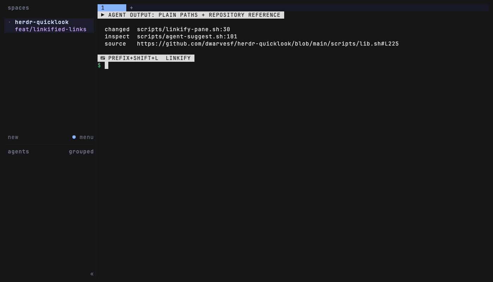
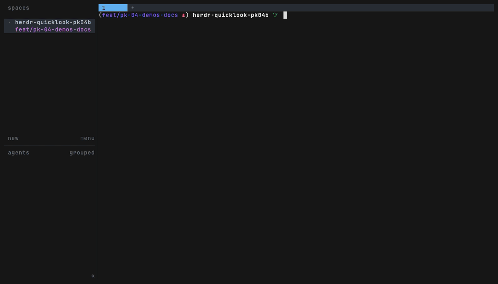
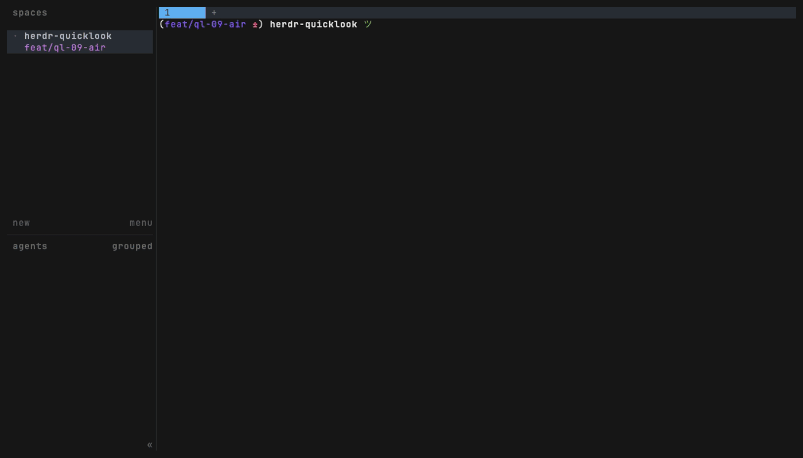
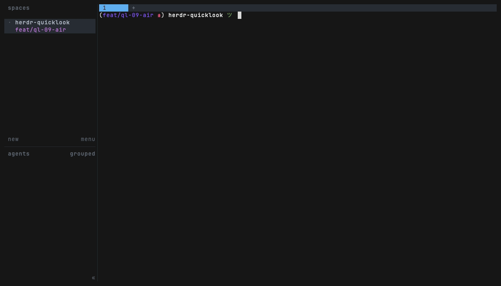
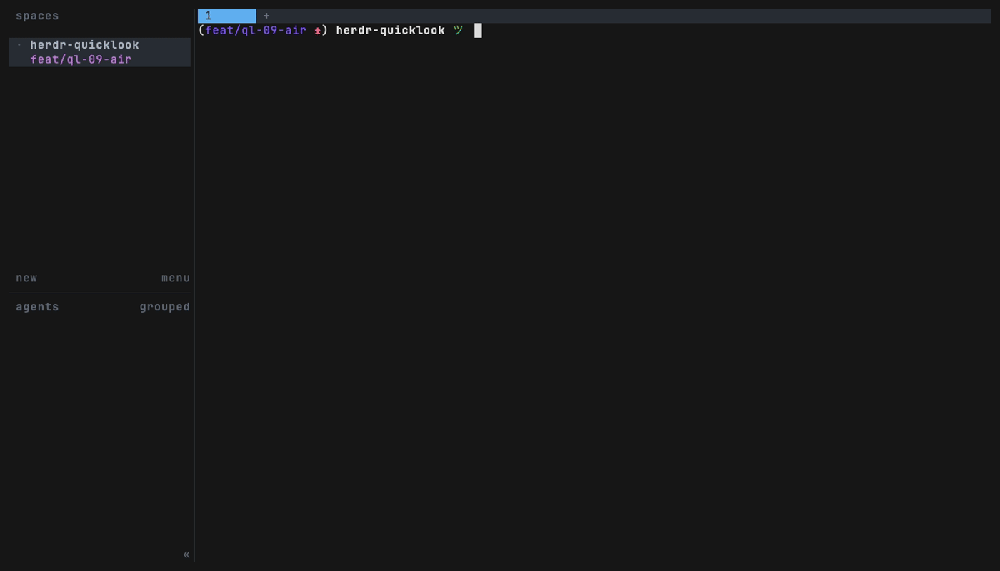

# herdr-quicklook


[](LICENSE)
[](https://github.com/dwarvesf/herdr-quicklook/stargazers)

**Open whatever path or URL an agent puts in front of you, without leaving [herdr](https://herdr.dev).** Copy a token (a file path, `path:123`, a bare filename, an http(s) URL), hit one key, and it opens in the right place: an overlay preview pane, the [herdr-file-viewer](https://github.com/smarzban/herdr-file-viewer) tree, or your browser. Supported repository URLs work with Ctrl+click directly; the link overlay makes bare paths and every other detected token Ctrl+clickable too.

Born from a daily annoyance: coding agents print file paths all day (`src/api/handler.go:142`), and reviewing one meant leaving the terminal or retyping the path. With the hint picker the whole loop is two keystrokes: `prefix+v`, then one letter.

A few things that make it more than a pager:

- **A GitHub link opens your local file.** Paste `github.com/org/repo/blob/main/src/x.go#L42` and it opens *your checkout* at line 42, not a browser tab, resolving across worktrees and your other repos.
- **One key, hints in place.** `prefix+v` dims the pane and overlays a one-letter hint on every openable token, pluck-style, columns never shift. Type the letter (or Ctrl+click the token) and it opens: files in the preview popup, directories in the file-viewer's own tab, URLs in the browser. Repository URLs are also Ctrl+clickable directly in any pane, no overlay needed.
- **An agent can put a file on your screen.** Set `QUICKLOOK_TOKEN` directly, or opt into agent suggestions that scan only output produced during the latest working turn.
- **Quick look, then commit to it.** Reading in the overlay and want the full tree? One key (`o`) escalates the same file, at the same line, into [herdr-file-viewer](https://github.com/smarzban/herdr-file-viewer).
- **Or straight into your editor.** `e` opens the same file, at the same line, in `$EDITOR` (config-overridable); the overlay resumes once you close it.

## What it opens

| Clipboard content | What happens |
|---|---|
| a GitHub / GitLab / Bitbucket **blob or raw URL** (`github.com/o/r/blob/main/x.go#L42`, `gitlab.com/o/r/-/blob/main/x.go#L42`, `bitbucket.org/o/r/src/main/x.go#lines-42`, `raw.githubusercontent.com/…`) | Opens the file in your **local checkout** at that line when one exists (current repo, worktrees, `QUICKLOOK_ROOTS/<repo>`); otherwise the browser |
| a bare commit **SHA** (7-40 hex chars) | `git show` for that commit, paged in the popup |
| `#123`, or a GitHub **PR URL** (`github.com/o/r/pull/123`) | `gh pr view`, paged in the popup |
| any other `https://…` / `http://…` | Opens in your default browser |
| `/absolute/path/file.md` | Preview (or viewer) at that file |
| `relative/path/file.md` | Resolved against the focused pane's cwd, then its git root |
| a path from **another worktree** of the same repo | Resolved via `git worktree list`, both directions |
| `path/file.md:123` | Opens with line 123 highlighted (`:123` jump in the viewer) |
| a path under one of your `QUICKLOOK_ROOTS` | Resolved against each configured root |
| `filename.md` (bare, no directory) | Repo-wide search of tracked files: one hit opens; several hits open an fzf pick |
| `some/dir` (a directory, not a file) | Opens herdr-file-viewer rooted there when installed, else an `eza --tree`/`ls -la` listing in the popup |

Resolution runs top-down: exact paths win before any fuzzy matching, and the first hit stops the chain. See [DESIGN.md](DESIGN.md) for how a token kind maps to its handler.

## Install

```sh
herdr plugin install dwarvesf/herdr-quicklook
```

Bind whichever actions you want in `~/.config/herdr/config.toml`. Native `plugin_action` bindings preserve herdr's plugin context and avoid an extra shell/CLI hop:

```toml
[[keys.command]]              # hint-pick anything openable on screen - the unified entry
key = "prefix+v"
type = "plugin_action"
command = "herdr-quicklook.hint"

[[keys.command]]              # open inside the file-viewer pane (optional)
key = "prefix+o"
type = "plugin_action"
command = "herdr-quicklook.open-in-viewer"

[[keys.command]]              # reopen a recent quicklook
key = "prefix+shift+v"
type = "plugin_action"
command = "herdr-quicklook.recents"


[[keys.command]]              # open the latest opt-in agent suggestion
key = "prefix+shift+a"
type = "plugin_action"
command = "herdr-quicklook.agent-suggestion"
```

Reload with `herdr server reload-config`.

`hint` needs no other plugin, so it is the recommended `prefix+v` binding
above; `preview` (opens the clipboard token directly, no scan) is still a
valid action id if you'd rather bind that directly instead.

## Keys in the preview overlay

| Key | Does |
|---|---|
| `q` or `Esc Esc` | Close the overlay (a bare Esc cannot coexist with arrow-key scrolling in less, so quit is double-Esc) |
| `o` (or `v`) | **Escalate**: close the overlay and open this file, at the same line, in the herdr-file-viewer pane (when that plugin is installed) |
| `e` | **Edit**: open this file, at the same line, in `$EDITOR` (config-overridable, default `zed --wait`); the overlay resumes when the editor exits |
| `d` | **Diff**: open a nested pager on `git diff` for this file (delta-colored if installed, else git's own color); press `d` again (or `q`) to close it and resume the file view. A clean file just prints a no-changes notice |
| `/`, `n`, `N` | Search inside the file |
| arrows / PgUp / PgDn | Scroll |

The overlay is sized by herdr; it closes itself after handing a URL to the browser.

## Recents (`prefix+shift+v`)

Every successful open (a file, a URL, a `command`/`viewer`-mode result) is recorded to a small, bounded log (last 20, deduped: reopening something already in the log just moves it back to the front). Press the binding and it reopens the most recent entry directly; with [`fzf`](https://github.com/junegunn/fzf) installed and more than one entry, it opens an fzf pick over the last N instead.

The log lives outside any git repo, at `${XDG_STATE_HOME:-~/.local/state}/herdr-quicklook/recents`, never inside your working tree. Recording is best-effort: a write failure (unwritable state dir, or the guard above refusing a path that resolved inside a repo) never blocks the open it was trying to record.

## Hint picker (`prefix+v`)

The one picker. Press the binding and the pane re-renders dimmed with a one-letter hint overlaid, pluck-style, on every openable token: the letter replaces the token's first character (bold black on bright yellow), the rest of the token turns yellow, and columns never shift, so you keep the full context of the screen you were reading. Type the letter and the token opens by TYPE: a file in the preview popup, a directory in the file-viewer's own tab, a URL in the browser, a SHA through `git show`. `Esc` or `q` cancels.

Every hinted token is also an OSC-8 link on this plugin's `.invalid` sentinel transport, so Ctrl+click opens the same way the letter does. The sentinel URLs are accepted only after a canonical encode/decode check; they are an internal transport, never a network destination.

**Clipboard-first, immediate.** If the clipboard holds a token that is visible on screen and resolves (you just selected+copied the exact thing you want), `prefix+v` skips the overlay and opens it right away, routed by the same type rules. A visible clipboard path that does NOT resolve (partial or mistyped) drops into the fzf finder pre-seeded with it instead, so the closest real files are one keystroke away. A stale clipboard from an hour ago never hijacks the picker: the text must actually be on screen.

**Detection is shape-first and fast.** The scan classifies by shape (slash-paths, `~/` paths, dotted filenames, URLs, SHAs, `#refs`), defers real resolution to the open step, and stats the filesystem only for the one ambiguous class (a single-slash token with no extension, `pair/leaf` vs prose like `rust/go`). Bare-word fuzzy filename matches are off by default (`QUICKLOOK_HINT_NAMES=1` re-enables them; `QUICKLOOK_HINT_VERIFIED=1` restores the slower fully-verified scan). The overlay paints the dimmed snapshot instantly and the hints land as soon as the background scan finishes; tokens the height-clamp or line-rewrap cannot pin in place stay pickable from a short list under the snapshot.

Repository URLs (GitHub blob/raw/PR, GitLab blob, Bitbucket source) are ALSO Ctrl+clickable directly in any pane, no overlay needed: narrow link handlers route them through the quicklook resolver, opening a local checkout or `gh pr view` when possible before falling back to the browser.

## Find a file (`prefix+/` suggested)

The `find` action opens an fzf overlay over the repo's tracked files (outside a repo, a bounded `find`), with a live bat preview rendering WHILE you type. Enter opens the pick in the same preview overlay as every other open, so `o`/`e`/`d` keep working; Esc closes. This is the proactive complement to the passive bare-name fallback (a copied ambiguous filename already fzf-picks among its matches).

## Agent suggestions (opt-in)

Set `QUICKLOOK_AGENT_SUGGESTIONS=notify` to watch herdr's low-volume `pane.agent_status_changed` event. When an agent starts working, quicklook records a transcript baseline. When it reaches `done` or `idle`, only text added during that turn is scanned; the highest-confidence token is saved as the latest suggestion and shown in a herdr notification. The `agent-suggestion` action opens it later using the producing pane's cwd.

Set the value to `preview` instead to open the detected token immediately. This can steal focus when a background agent finishes, so `notify` is the recommended mode and the feature defaults to `off`. Repeated presentation events are deduped, and no polling process or output-change daemon is started.

## Configuration

Optional. Create `.env` in the directory `herdr plugin config-dir herdr-quicklook` prints:

```sh
# Extra roots to try for relative paths, colon-separated. Useful when tools
# print repo-prefixed paths like "myrepo/docs/notes.md" and all your repos
# live under one parent directory.
QUICKLOOK_ROOTS="$HOME/workspace:$HOME/src"

# Command launched by `e` in the overlay. Precedence: this key > $EDITOR >
# "zed --wait". Set it here rather than relying on $EDITOR alone: the herdr
# server process that launches this pane does not reliably inherit an
# interactive shell's exported vars.
QUICKLOOK_EDITOR="zed --wait"

# Optional agent completion suggestions: off (default), notify, or preview.
# `preview` opens an overlay immediately and may interrupt the active pane.
QUICKLOOK_AGENT_SUGGESTIONS="notify"

# Hint picker: re-enable bare-word fuzzy filename hints (noisy, off by default)
#QUICKLOOK_HINT_NAMES=1
# Hint picker: restore the slower fully-verified scan instead of shape-first
#QUICKLOOK_HINT_VERIFIED=1

# Number of recent unwrapped pane lines retained for per-turn baselines.
QUICKLOOK_AGENT_SCAN_LINES=300
```

## Agent-push (programmatic tokens)

The plugin reads, in priority order: `$QUICKLOOK_TOKEN` env > script argument > clipboard. That gives an agent (or any script) a way to put a file on the human's screen without touching their clipboard:

```sh
# pop the overlay for a specific file+line
herdr plugin pane open --plugin herdr-quicklook --entrypoint preview \
  --placement overlay --focus --env QUICKLOOK_TOKEN="src/handler.go:142"
```

An empty `QUICKLOOK_TOKEN` is treated as unset; the interactive clipboard flow is unchanged when neither env nor argument is given.

## Development

```sh
shellcheck -x scripts/*.sh && bats tests/   # brew install shellcheck bats-core
```

The bats suite sources `scripts/lib.sh` directly (temp git repo + worktree + roots fixture), so it exercises the exact production resolve chain.

## Release

Maintainer-only, run by hand, no CI trigger:

```sh
./scripts/release.sh 0.3.0
```

One command: sanity checks (clean tree, on `main`, shellcheck + bats green, tag
doesn't already exist), bumps `herdr-plugin.toml`'s version, moves
`CHANGELOG.md`'s `## Unreleased` section into a dated `## 0.3.0 (…)` section,
commits `chore(release): v0.3.0`, tags it, pushes commit + tag, and cuts a
GitHub release (`gh release create`) with that changelog section as the notes
body. Refuses to run against a dirty tree, a non-`main` branch, or an
already-tagged version.

## Demo

**Ctrl+click bare paths without an upstream change** - every hinted token in the `prefix+v` overlay is an OSC-8 link; a real Ctrl+click opens it locally, and a GitHub blob URL Ctrl+clicks straight into the local checkout from any pane (recorded before the hint consolidation; the flow is the same, the overlay is now the in-place hint picker):



**Pick anything on screen** - `prefix+v` on a busy pane (real commits, `ls`, a URL) opens the ranked, count-headered pick list; a pick opens in the preview overlay. Plus the negative control: an empty pane and an empty clipboard yield the honest "nothing openable on screen" instead of a crash:



**Every token kind in one pass** - a plain path, a GitHub blob URL (opens the local file), a bare commit SHA (`git show`), a `#123` PR reference (`gh pr view`), a directory (`eza --tree`):


**The three in-overlay keys** - `d` (dirty-diff toggle), `e` (edit in `$EDITOR`), `o` (escalate to herdr-file-viewer):



**Recents** - fzf-pick an older entry; reopening bumps it back to the front:



**The one-key pluck chain** - herdr-pluck's hint overlay pops, pick a token, quick-look opens it immediately:



Tapes for every recording live in [demo/](demo/), along with the landmines hit re-recording them on macOS.

## Requirements

Hard requirements: **herdr >= 0.7.0**, `jq`, and a clipboard reader (`pbpaste` on macOS, `wl-paste` or `xclip` on Linux). Every action, including the scanner-backed `hint` overlay and enabled agent suggestions, runs under the system bash - macOS's own `/bin/bash` (3.2) is fully supported, no Homebrew `bash` required.

Everything else is optional, and the plugin degrades instead of failing:

| Dependency | Used for | Without it |
|---|---|---|
| [`bat`](https://github.com/sharkdp/bat) | syntax-highlighted preview | plain `less` renders the file |
| [`fzf`](https://github.com/junegunn/fzf) | picking among multiple bare-filename matches in the preview flow, and the `recents` list | single bare-filename matches still open, multiple are listed so you can copy an exact path; `recents` reopens the most recent entry directly |
| [herdr-file-viewer](https://github.com/smarzban/herdr-file-viewer) plugin | the `open-in-viewer` action | the action falls back to the preview overlay automatically |

## Prerequisites

v0.4 renders non-text files (markdown, images, pdf, archives, csv, json, office docs, media, sqlite/plist, and more) in the preview overlay instead of paging raw bytes. Every renderer beyond the hard requirements above is optional and degrades gracefully: a missing tool never crashes the overlay, it falls back to a plainer render (or, at the floor, the always-on `file(1)` + `hexyl` guard) with a one-line install hint.

```sh
./scripts/install-renderers.sh            # preview only, installs nothing (the default)
./scripts/install-renderers.sh --p1 --apply   # actually install just the P1 tier
```

`--dry-run` is the default (a bare invocation is identical); it previews the brew formula for each tier and skips anything already on `PATH`, touching nothing. `--apply` is the explicit opt-in that runs `brew install`. `--p1`/`--p2`/`--p3` are repeatable and select a tier; with none given, every tier is previewed/installed. No Homebrew? The script detects that and prints the manual (`apt`/`cargo`) fallback line as a comment instead of failing.

| Tier | Tool | Powers | Without it |
|---|---|---|---|
| P1 | [`glow`](https://github.com/charmbracelet/glow) | markdown (`.md`/`.markdown`), and the rendered half of `.ipynb` (via `pandoc`'s markdown conversion) | falls back to the `file(1)`+`hexyl` guard with an install hint |
| P1 | [`chafa`](https://github.com/hpjansson/chafa) | still images (`png`/`jpg`/`jpeg`/`webp`/`bmp`) and animated gif (`.gif`, first-frame still if `--animate` degrades) | images/gif fall back to the `file(1)`+`hexyl` guard with an install hint |
| P1 | [`hexyl`](https://github.com/sharkdp/hexyl) | the first-KB hexdump in the always-on unknown-binary guard | the guard still shows the `file(1)` type line + install hint, just without the hexdump |
| P2 | `rsvg-convert` (Homebrew `librsvg`) | svg (`.svg`) -> png -> `chafa` | falls back to the `file(1)`+`hexyl` guard with an install hint |
| P2 | `pdftoppm` + `pdftotext` (Homebrew `poppler`) | pdf (`.pdf`): first-page image (`pdftoppm` -> `chafa`) plus extracted text | missing `pdftoppm` degrades to `pdftotext`-only text mode; missing both falls back to the `file(1)`+`hexyl` guard with an install hint |
| P2 | [`qsv`](https://github.com/dathere/qsv) | csv/tsv (`.csv`/`.tsv`) as an aligned table | renders as plain text via `less`, then the guard if even that fails |
| P2 | [`jq`](https://github.com/jqlang/jq) | minified json (`.json`), pretty-printed | renders as plain text via `less`, then the guard if even that fails |
| P3 | [`pandoc`](https://pandoc.org/) | office docs (`docx`/`xlsx` -> markdown or csv) and `.ipynb` notebooks (-> markdown, then `glow`) | office docs fall back to the `file(1)`+`hexyl` guard with an install hint; notebooks degrade to plain text, then the guard |
| P3 | `ffprobe` + `ffmpeg` (Homebrew `ffmpeg`) | media (`mp4`/`mov`/`mp3`): metadata plus a poster-frame image (never playback) | missing `ffmpeg` degrades to `ffprobe` metadata only; missing both falls back to the `file(1)`+`hexyl` guard with an install hint |
| P3 | `sqlite3` (Homebrew `sqlite`) | sqlite databases (`.sqlite`/`.db`): schema + table listing | falls back to the `file(1)`+`hexyl` guard with an install hint |
| , (base-system) | `unzip` / `tar` | archives (`zip`/`tar`/`tgz`/`jar`): content listing (`unzip -l` / `tar -tf`) | always present on macOS + Linux; not installed by this script |
| , (base-system) | `plutil` | plist files (`.plist`): structured dump (`plutil -p`) | always present on macOS; not installed by this script |
| , (base-system, hard dependency) | `file` | the mime/type discriminator every renderer (and the always-on fallback) is gated on | always present on macOS + Linux; not installed by this script |

## How it works

- **preview** opens a plugin overlay pane (a real TTY), reads `$QUICKLOOK_TOKEN`, an argument, or the clipboard, resolves it through the [handler registry](DESIGN.md#handler-registry), and renders it per `RESOLVED_MODE`: a `file` opens in `less` (bat as the `LESSOPEN` colorizer), a `browser` URL is handed to `url_open` and the overlay closes, a `command` token (vcs) or `viewer` degrade (a directory without herdr-file-viewer installed) pages its output through `less -R`. Esc-to-quit and the three in-popup shell-escapes ship via a `lesskey` file: `o` escalates via less's single `visual` slot (`$VISUAL` -> `escalate.sh`); `e` and `d` cannot reuse that slot, so `e` is bound to less's `pshell` action (`escalate-editor.sh`) and `d` to its `shell` action (`dirty-diff.sh`), each with a `^P` extra-string prefix that suppresses the shell-escape's normal "done" prompt so the overlay resumes cleanly. See [DESIGN.md](DESIGN.md#the-lesskey-three-slot-map) for why there are only three slots to go around.
- **open-in-viewer** has no goto-file API to call, so it drives the viewer's own keys over the herdr socket: it ensures a `Files` pane exists in the focused tab (opening one via the viewer's action if needed), then sends `f`, types the repo-relative path, and presses Enter; `path:123` follows up with the viewer's `:` goto-line. A directory token reuses the same goto-path sequence to root the viewer there. This is UI-scripting by nature: if the viewer's keymap changes upstream, this action needs a revisit.
- **recents** has no TTY of its own either (herdr runs every action's command headless), so it opens a second overlay pane (`recents-pick`) just for the fzf pick; the chosen entry is then handed to the same `preview` overlay-rendering code (`preview-pane.sh`, `exec`'d in place, not a third pane) so a reopened entry resolves and records exactly like a fresh open.
- **hint** captures the origin pane id before opening its overlay (`pane current` would return the overlay itself once it has focus), reads and strips the pane's visible text, then opens the overlay IMMEDIATELY while the token scan finishes in a background subshell. Two herdr constraints shape this split: a plugin pane must never be opened with `--cwd` (herdr resolves the pane's relative command against it and the pane flash-closes; the origin cwd rides as an env var instead), and a server RPC issued from inside a server-spawned overlay pane deadlocks (so the overlay only reads two prepared files and a keypress, no RPC at all). The overlay paints the dimmed snapshot in one write, overlays hints in place in a second write (autowrap off, height-clamped, so it can never scroll and corrupt itself), and a keypress resolves the token through the full handler registry, routing a `viewer` result into `open-in-viewer` and everything else through `preview-pane.sh`. Every hinted token doubles as an OSC-8 sentinel link; Ctrl+click invokes `open-link`, which decodes the token and routes it back through `preview`.
- **agent suggestions** use one low-volume herdr status hook, not an output hook or polling process. The hook exits immediately by default; when enabled, it stores a per-pane baseline at `working`, scans the completion delta at `done`/`idle`, and writes the newest suggestion under Herdr's plugin state directory.

Full architecture, the token-flow diagram, and the handler contract for adding a new token kind: [DESIGN.md](DESIGN.md).

## Limitations

- Herdr only sends Ctrl-clicks for http(s) cells to plugin handlers. Bare paths in the original pane therefore require the `hint` overlay or the clipboard flow; quicklook cannot alter another pane's rendered cells.
- `preview`/`open-in-viewer`/`recents` consume one token at a time; `hint` scans pane text.
- `hint` scans the pane's visible text by default (`QUICKLOOK_PICK_SOURCE=recent` or `recent-unwrapped` opts into scrollback); it does not read inside `less`/`bat`'s own paged output or a nested pane. Hints cap at the 25 single-letter keys (`q` is reserved for cancel), ranked best-first.
- The hint overlay is a bordered herdr pane, so its interior sits ~1 column/row off the origin pane and long lines truncate at its right edge (autowrap is off so the layout can never scroll or shift). A rect-matched borderless surface like herdr-pluck's would need a compiled renderer, out of scope for a bash plugin.
- Agent suggestions scan only the configured recent-unwrapped turn window and depend on herdr detecting the pane as an agent and observing a `working` event before `done`/`idle`. A completion with no recorded baseline intentionally produces no stale suggestion.
- `open-in-viewer` only reaches files inside the focused pane's repo (the viewer roots there); anything outside gets a notification pointing at the preview overlay instead.
- GitHub-URL resolution matches the URL's `<repo>` against the **current checkout's directory name**. If two unrelated local repos share a directory name it can open the same-named file in the wrong one; a URL for a repo you have no local checkout of falls back to the browser.
- Windows is untested (clipboard/opener cascades cover macOS + Linux).

## License

MIT
