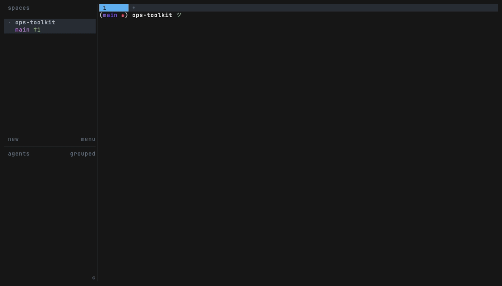

# herdr-quicklook


[](LICENSE)
[](https://github.com/dwarvesf/herdr-quicklook/stargazers)

**Open whatever path or URL is on your clipboard, without leaving [herdr](https://herdr.dev).** Copy a token (a file path, `path:123`, a bare filename, an http(s) URL), hit one key, and it opens in the right place: an overlay preview pane, the [herdr-file-viewer](https://github.com/smarzban/herdr-file-viewer) tree, or your browser.

Born from a daily annoyance: coding agents print file paths all day (`src/api/handler.go:142`), and reviewing one meant leaving the terminal or retyping the path. Pair this with a hint-copy plugin like [herdr-pluck](https://github.com/rmarganti/herdr-pluck) and the whole loop is two keystrokes: pluck the path, pop the file.

## What it opens

| Clipboard content | What happens |
|---|---|
| `https://…` / `http://…` | Opens in your default browser |
| `/absolute/path/file.md` | Preview (or viewer) at that file |
| `relative/path/file.md` | Resolved against the focused pane's cwd, then its git root |
| a path from **another worktree** of the same repo | Resolved via `git worktree list`, both directions |
| `path/file.md:123` | Opens with line 123 highlighted (`:123` jump in the viewer) |
| a path under one of your `QUICKLOOK_ROOTS` | Resolved against each configured root |
| `filename.md` (bare, no directory) | Repo-wide search of tracked files: one hit opens; several hits open an fzf pick |

Resolution runs top-down: exact paths win before any fuzzy matching, and the first hit stops the chain.

## Install

```sh
herdr plugin install dwarvesf/herdr-quicklook
```

Then bind the two actions in `~/.config/herdr/config.toml`:

```toml
[[keys.command]]              # overlay preview
key = "prefix+v"
type = "shell"
command = "herdr plugin action invoke preview --plugin herdr-quicklook"

[[keys.command]]              # open inside the file-viewer pane (optional)
key = "prefix+o"
type = "shell"
command = "herdr plugin action invoke open-in-viewer --plugin herdr-quicklook"
```

Reload with `herdr server reload-config`.

## Keys in the preview overlay

| Key | Does |
|---|---|
| `q` or `Esc Esc` | Close the overlay (a bare Esc cannot coexist with arrow-key scrolling in less, so quit is double-Esc) |
| `o` (or `v`) | **Escalate**: close the overlay and open this file, at the same line, in the herdr-file-viewer pane (when that plugin is installed) |
| `/`, `n`, `N` | Search inside the file |
| arrows / PgUp / PgDn | Scroll |

The overlay is sized by herdr; it closes itself after handing a URL to the browser.

## Configuration

Optional. Create `.env` in the directory `herdr plugin config-dir herdr-quicklook` prints:

```sh
# Extra roots to try for relative paths, colon-separated. Useful when tools
# print repo-prefixed paths like "myrepo/docs/notes.md" and all your repos
# live under one parent directory.
QUICKLOOK_ROOTS="$HOME/workspace:$HOME/src"
```

## Agent-push (programmatic tokens)

The plugin reads, in priority order: `$QUICKLOOK_TOKEN` env > script argument > clipboard. That gives an agent (or any script) a way to put a file on the human's screen without touching their clipboard:

```sh
# pop the overlay for a specific file+line
herdr plugin pane open --plugin herdr-quicklook --entrypoint preview \
  --placement overlay --focus --env QUICKLOOK_TOKEN="src/handler.go:142"
```

An empty `QUICKLOOK_TOKEN` is treated as unset; the interactive clipboard flow is unchanged when neither env nor argument is given.

## Development

```sh
shellcheck -x scripts/*.sh && bats tests/   # brew install shellcheck bats-core
```

The bats suite sources `scripts/lib.sh` directly (temp git repo + worktree + roots fixture), so it exercises the exact production resolve chain.

## Demo



More recordings (the file-viewer escalation, the multi-link flow with hint labels) are on the way; the tapes live in [demo/](demo/).

## Requirements

Hard requirements: **herdr >= 0.7.0**, `jq`, and a clipboard reader (`pbpaste` on macOS, `wl-paste` or `xclip` on Linux).

Everything else is optional, and the plugin degrades instead of failing:

| Dependency | Used for | Without it |
|---|---|---|
| [`bat`](https://github.com/sharkdp/bat) | syntax-highlighted preview | plain `less` renders the file |
| [`fzf`](https://github.com/junegunn/fzf) | picking among multiple bare-filename matches | single matches still open; multiple matches are listed so you can copy an exact path |
| [herdr-file-viewer](https://github.com/smarzban/herdr-file-viewer) plugin | the `open-in-viewer` action | the action falls back to the preview overlay automatically |
| [herdr-pluck](https://github.com/rmarganti/herdr-pluck) plugin | one-keystroke path copy (recommended pairing) | any other way of copying a path works the same |

## How it works

- **preview** opens a plugin overlay pane (a real TTY) that reads the clipboard, resolves the token, and renders it with `less` (bat as the `LESSOPEN` colorizer). Esc-to-quit ships via a `lesskey` file.
- **open-in-viewer** has no goto-file API to call, so it drives the viewer's own keys over the herdr socket: it ensures a `Files` pane exists in the focused tab (opening one via the viewer's action if needed), then sends `f`, types the repo-relative path, and presses Enter; `path:123` follows up with the viewer's `:` goto-line. This is UI-scripting by nature: if the viewer's keymap changes upstream, this action needs a revisit.
- No event hooks, no daemons, nothing runs until you press your key.

## Limitations

- One token at a time: it reads the clipboard, it does not scan the screen (that is the hint-copy plugin's job).
- `open-in-viewer` only reaches files inside the focused pane's repo (the viewer roots there); anything outside gets a notification pointing at the preview overlay instead.
- Windows is untested (clipboard/opener cascades cover macOS + Linux).

## License

MIT
