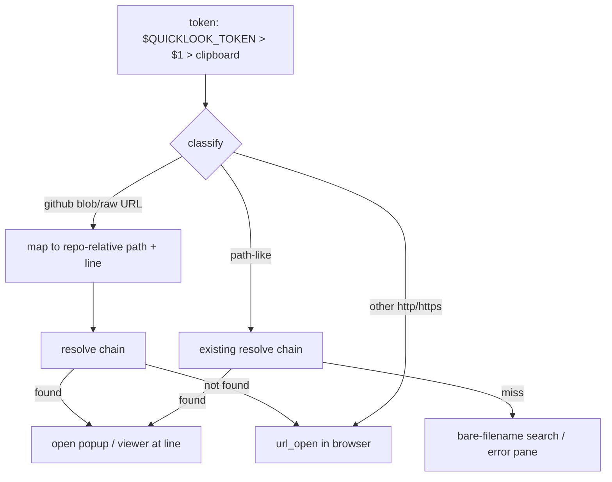

# Spec: blob-URL mapping, programmatic tokens, and a bats test suite

Generated: 2026-07-16
Status: APPROVED
References: `scripts/lib.sh` resolve chain (imitate its first-hit-wins ordering and
`[ -f ]` probing); ops-toolkit `research/2026-07-16-herdr-token-open-pipeline.md`
(mechanics + gotchas this spec must not regress).

## Problem

Three gaps found in real use on day one:

1. Agents print GitHub blob URLs (`https://github.com/o/r/blob/main/src/x.go#L42`)
   for files that exist in a LOCAL checkout; today those always open the browser,
   losing the line-jump and the local context.
2. An agent (Hermes, Claude Code) cannot put a file on the human's screen: the
   plugin only reads the clipboard, so there is no programmatic entry point
   ("agent-push").
3. Zero automated tests. The resolve chain is the load-bearing logic and it is
   about to grow; regressions would only be caught by hand.

## Solution

### Approaches considered

1. **Extend `lib.sh` with a URL-mapper + token override, add bats suite**, small
   diffs inside the existing structure; tradeoff: lib.sh grows toward the 3-sentence
   unit boundary.
2. Rewrite resolution in a real language (Go/Rust binary like the file-viewer), testable and fast, but throws away a working bash core the day after release and
   raises the install cost (build step). Rejected: premature.
3. Token-argument-only (skip URL mapping), smallest, but leaves gap 1, the most
   common agent output shape. Rejected: does not cover the observed pain.

### Chosen approach + why

Approach 1. The logic stays one `[ -f ]`-probe chain in bash; bats can source
`lib.sh` directly, so the suite tests the exact production code, not a port.

### Extensibility & boundaries

- Load-bearing dimension: **token kinds**. Each new kind (SHA, PR number, dir) is
  one new classifier branch in `classify_token` + one resolver function; the spec
  fixes that seam now so later kinds do not grow `preview-pane.sh` inline.
- Unit boundaries: `lib.sh` = pure functions (no TTY, no pane calls), testable
  headless; pane/viewer scripts = side effects only.

## Design

**Ordering:** the token contract first (hardest to change once agents depend on
it), URL mapping second, tests last (mechanical).

### Approaches considered + chosen

See `## Solution`.

### Diagram (flowchart: token classification)



### ADR link(s)

No irreversible decision: everything here is additive bash behind the existing
actions. The token-priority contract (env > arg > clipboard) is recorded in
DEC-002; if it ever needs breaking, that is a major-version bump, not an ADR.

### Boundaries & failure modes

Touches no data stores and one external shape (GitHub URL formats); see
`## Failure modes`.

## Technical Design

### Interfaces (I/O contract)

- Inputs / consumes:
  - Token, priority order: `$QUICKLOOK_TOKEN` env > first script argument >
    clipboard. Same contract in BOTH `preview-pane.sh` (env reaches it via
    `herdr plugin pane open --env`) and `open-in-viewer.sh`.
  - GitHub URL shapes accepted: `https://github.com/<o>/<r>/blob/<ref>/<path>[#L<n>[-L<m>]]`,
    `https://github.com/<o>/<r>/raw/<ref>/<path>`, `https://raw.githubusercontent.com/<o>/<r>/<ref>/<path>`.
- Outputs / produces: unchanged (popup render, viewer drive, browser open,
  notification on miss).
- Invariants:
  - A non-GitHub http(s) URL still ALWAYS opens the browser.
  - A GitHub blob URL whose path cannot be resolved locally falls back to the
    browser (never a dead error pane).
  - Existing clipboard-only flow is byte-for-byte unaffected when no env/arg given.

### Data model changes

None.

### API changes

New documented agent-push recipes (README):

```sh
# overlay on the human's screen
herdr plugin pane open --plugin herdr-quicklook --entrypoint preview \
  --placement overlay --focus --env QUICKLOOK_TOKEN="path/to/file.md:42"
# or into the file-viewer pane
bash <plugin_root>/scripts/open-in-viewer.sh "path/to/file.md:42"
```

### UI changes

None visible beyond the new behaviors.

### Infrastructure changes

`tests/` (bats-core) + `make test` (or `bats tests/`) documented in README.

## Task Breakdown

### Phase 1: Foundation

- [ ] TASK-001: `lib.sh`: add `classify_token` (github-blob | url | pathish) and
      `map_github_url` (owner/repo/ref/path/line extraction, the three accepted
      shapes) as pure functions, acceptance: bats cases pass for all three
      shapes + `#L42` and `#L42-L60` (start line wins) + non-GitHub URL returns
      non-blob class.
- [ ] TASK-002: `lib.sh`: `pick_token` implementing env > arg > clipboard, acceptance: bats cases prove the priority order and the empty-everything case.

### Phase 2: Core

- [ ] TASK-003: `preview-pane.sh` + `open-in-viewer.sh` consume `pick_token` +
      `classify_token`; blob URLs resolve via: same-repo-name short-circuit
      (current repo name == `<r>` -> resolve `<path>` in it), else resolve chain,
      else each `QUICKLOOK_ROOTS` entry + `/<r>/<path>`; miss -> `url_open`, acceptance: shellcheck clean; manual matrix in the proof of done.
- [ ] TASK-004: `open-preview.sh` forwards a token argument as
      `--env QUICKLOOK_TOKEN=...` when invoked with one, acceptance: bats-level
      arg parsing + recorded live invocation.

### Phase 3: Polish

- [ ] TASK-005: bats suite `tests/*.bats` covering the FULL existing resolve chain
      (as-is / cwd / worktree / roots / bare-name single + multi) plus the new
      functions; fixture repo built in `setup()` with a temp git repo + worktree, acceptance: `bats tests/` green locally; every case fails if its logic is
      reverted (spot-check one mutation).
- [ ] TASK-006: README: agent-push section + URL table row + tests section;
      CHANGELOG 0.2.0, acceptance: docs mention every new behavior; no stale
      claims.

## After state

- [ ] A GitHub blob URL on the clipboard opens the LOCAL file at the line when a
      matching checkout exists, and the browser otherwise. (Today: always browser.)
- [ ] `herdr plugin pane open ... --env QUICKLOOK_TOKEN=x` opens the overlay for
      `x` without touching the clipboard. (Today: impossible.)
- [ ] `bats tests/` exists and is green, covering resolve + parse + classify +
      priority. (Today: no tests.) Checkable: `bats tests/`.

## Acceptance Criteria (global)

- [ ] All tasks pass their individual acceptance criteria
- [ ] Tests cover happy path + edge cases listed below
- [ ] No regressions: v0.1 clipboard flow behaves identically with no env/arg set

## Verification

```sh
cd <repo> && shellcheck -x scripts/*.sh && bats tests/
```

Plus one recorded live run of the agent-push overlay on a herdr host (Mini).

## Test plan

Coverage matrix (bats, sourcing `scripts/lib.sh`; fixture = temp git repo + one
worktree + a roots dir built in `setup()`):

| Area | Cases |
|---|---|
| `parse_token` | plain path; `path:123`; trailing `:`; `:notanumber` stays in path |
| `pick_token` | env>arg; arg>clipboard; env empty-string = unset; all empty |
| `classify_token` | blob URL; `/raw/` URL; raw.githubusercontent; generic https; http; plain path |
| `map_github_url` | owner/repo/ref/path extraction; `#L42`; `#L42-L60` -> 42; `%20` decode; no fragment |
| `resolve` | absolute; cwd-relative; cross-worktree (main-only file from worktree); QUICKLOOK_ROOTS; miss returns rc 1 |
| `resolve_github` | repo-name match under a root; ref containing `/` (successive split); unresolvable -> empty (browser fallback) |
| regression | with no env/arg, behavior identical to v0.1 for a clipboard path (one end-to-end resolve case) |

Negative control: one deliberate mutation run (invert a probe) must turn the
suite red; recorded in the proof of done.

## Edge Cases

1. Blob URL with `#L42-L60` range, use the start line.
2. Blob URL with url-encoded path (`%20`), decode before probing.
3. Blob URL for a repo that exists under a root with a DIFFERENT directory name
   than `<r>`, resolve falls through to the plain chain; browser fallback is
   acceptable (documented).
4. `QUICKLOOK_TOKEN` set to empty string, treated as unset (fall to arg/clipboard).
5. Token that is both a real file and looks like a URL fragment, path probing
   only runs for non-URL classes; URLs never hit the filesystem.
6. Branch names containing `/` in blob URLs, accept greedily: try successive
   ref/path splits until a probe hits; otherwise fall back to the browser (bats
   case documents the behavior).

## Failure modes

| Failure class | Detection signal | Mitigation / recovery |
|---|---|---|
| GitHub changes URL shapes | blob URLs start opening in browser again | classifier is additive; fallback is the old behavior, add the new shape + bats case |
| bats not installed on a contributor machine | `bats: command not found` | README documents `brew install bats-core`; CI can come later |
| env var leaks between popup invocations | stale file opens | open-preview passes `--env` per invocation; pane process exits after render, nothing persists |

## Out of Scope

- One-key pluck chain (needs pluck runtime; parked until the Air server restart).
- Commit-SHA / PR-number tokens, dirty-diff mode, directory targets, `e`-to-editor,
  recents (parked ideas list in the research note).
- CI workflow (local bats only for 0.2.0).

## Decision Log

- DEC-001: batch scope = blob-URL + agent-push + tests; approved by Han in-session
  2026-07-16 ("lên những cái này thành feature để làm... áp dụng bộ kit").
- DEC-002: token priority env > arg > clipboard, env is the only channel that
  crosses `plugin pane open`, arg is the natural CLI shape, clipboard stays the
  interactive default. Rejected: arg-over-env (pane commands cannot receive args).
- DEC-003: tests in bats-core sourcing `lib.sh` directly, tests the production
  file, zero porting. Rejected: rewriting logic in a "testable" language (see
  Approaches).

## Open questions

(none)
